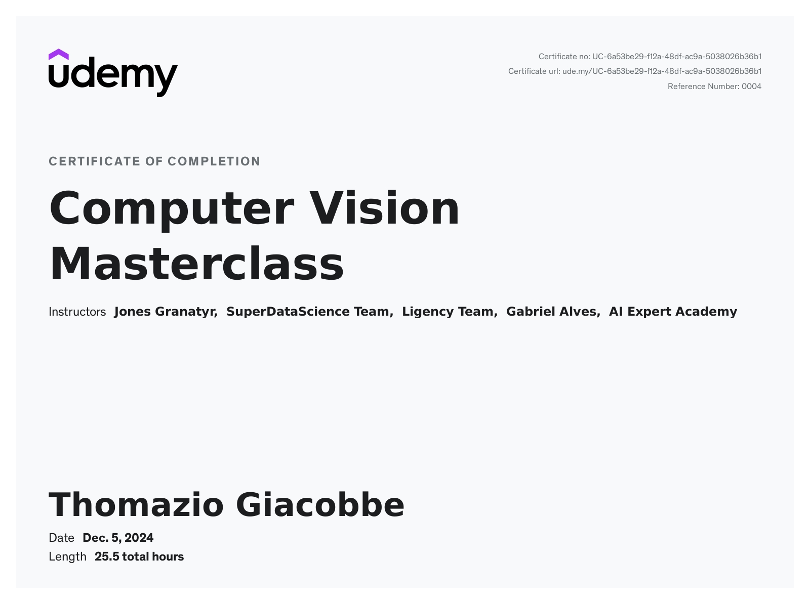

# Computer Vision Course

This repository contains scripts and notebooks developed as part of the Udemy course [Computer Vision Masterclass](https://www.udemy.com/course/computer-vision-masterclass). The projects were implemented in Google Colab, showcasing concepts and practical applications in computer vision.

